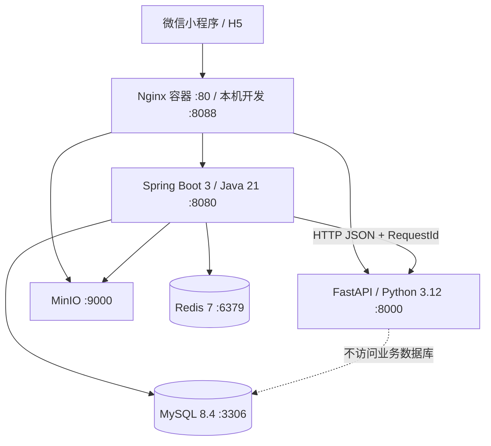

# 致宇健康

### 以医学数据为基础，以人工智能为引擎的全周期数字健康管理平台

**致宇健康**面向医院、体检中心、医生与个人用户，融合医学文档智能识别、多源健康数据治理、多维健康评估、大模型综合解读和持续健康随访能力，构建从“数据采集”到“健康洞察”，再到“行动改善”的智能闭环。

平台以检验报告、健康档案、生活方式、饮食运动、睡眠情绪、疾病史及家族健康史等多维数据为基础，通过 OCR 结构化识别、指标标准化、规则计算与大模型推理，将分散、复杂的健康数据转化为**可理解、可追踪、可行动**的个人健康洞察。系统不仅呈现当下的健康状态，更持续记录指标变化、识别潜在风险并生成个性化健康计划，让每一次体检都成为长期健康管理的起点。

> **让每一份健康数据，清晰、有序、可行动。**

## 核心能力

- **医学数据智能化：** 自动识别 PDF、扫描件和手机拍摄的检验报告，将非结构化医学文档转化为可计算、可追踪的标准健康指标。
- **多源健康数据融合：** 汇聚检验指标、基础档案、健康问卷、生活方式、疾病史与家族史，形成持续演化的个人健康画像。
- **多维健康智能评估：** 结合规则引擎与大模型推理，从代谢、心血管、肝肾功能、营养、睡眠、心理、体重及生活方式等维度进行综合分析。
- **可视化健康洞察：** 通过健康仪表盘、重点健康问题、趋势变化和结构化报告，帮助用户与医生快速掌握核心信息。
- **个性化健康随访：** 根据评估结果生成饮食、运动、作息等可执行任务，并结合用户反馈持续跟踪健康改善进程。
- **医院协同服务：** 支持合作医院管理、医生预录入、体检者查询及健康报告查看，让人工智能成为医院健康服务能力的数字化延伸。
- **可信技术底座：** 采用 Java 业务中台、Python AI 引擎与容器化基础设施，实现业务权限、数据隔离、对象存储和智能计算的分层治理。

> **健康管理声明：** 该结果仅用于健康管理参考，不构成医学诊断。

## 单小程序承载 B 端和 C 端

机构人员与普通客户使用同一套 uni-app 小程序和同一登录入口。账号可拥有一个或多个工作台；工作台决定首页摘要、卡片菜单、页面与按钮展示。真正的权限、租户和客户数据范围始终由 Java 服务端校验。

固定 TabBar：**首页 / 工作台 / 消息 / 我的**。业务页面按 C 端、机构业务端、机构管理端分包，避免主包膨胀。

## 系统架构



Java 是核心业务、权限控制和数据一致性的唯一入口；Python 承载 PaddleOCR、健康指标标准化、多维规则计算、大模型综合解读与智能随访能力，不直接访问业务数据库。

## 角色与工作台

| 账号角色 | 默认工作台 | 一期能力 |
|---|---|---|
| `PLATFORM_ADMIN` | 平台管理工作台 | 合作医院管理、医生预录入、平台反馈处理、全平台健康随访概览 |
| `DOCTOR` | 医生工作台 | 按姓名或手机号查询本院体检者，查看和下载健康评估报告，了解健康随访执行情况 |
| `CUSTOMER` | 个人健康中心 | 健康档案与问卷、检验报告上传、AI 健康评估、健康报告、指标趋势、健康随访与反馈 |

医生身份同时具备个人用户能力，可在医生工作台和个人健康中心之间切换。

## 技术栈

- 小程序：uni-app、Vue 3、TypeScript、Pinia、Vite、uni-ui、ECharts 依赖、ESLint、Prettier
- 业务端：Java 21、Spring Boot 3、Spring Security、JWT、Redis、MyBatis-Plus、Flyway、WebClient、MapStruct、Actuator、Springdoc
- AI 端：Python 3.12、FastAPI、Pydantic、PaddleOCR、PaddlePaddle、NumPy、Pandas、scikit-learn、Pytest、Ruff、Black、MyPy
- 基础设施：MySQL 8.4、Redis 7、MinIO、Nginx、Docker Compose

## 目录

```text
.
├─ rayk-server/          Java 核心业务服务
├─ rayk-ai/              Python AI HTTP 服务
├─ rayk-miniapp/         B/C 端统一小程序
├─ database/             Flyway 迁移与数据库说明
├─ deploy/nginx/         统一入口配置
├─ docs/                 架构、权限、API 与路线图
├─ scripts/              启停、构建、备份和恢复脚本
├─ backups/              仓库内备用占位（实际默认备份到 E 盘）
├─ compose.yml           通用服务定义
├─ compose.dev.yml       开发端口覆盖
└─ compose.prod.yml      生产端口覆盖
```

## Docker Desktop 与 E 盘存储

本机只需 Docker Desktop、浏览器、微信开发者工具和可选编辑器。Java、Maven、Python、MySQL、Redis、MinIO 与 Nginx 均由容器提供。

因 C 盘空间有限，请先手动设置：

1. Docker Desktop → **Settings** → **Resources** → **Advanced**。
2. 将 **Disk image location** 设置为 `E:\DockerData\DockerDesktop`。
3. 应用设置并等待 Docker Desktop 完成迁移。

建议 E 盘路径：

```text
E:\DockerData\DockerDesktop             Docker 镜像、容器、缓存、命名卷
E:\DockerData\RayKA1\backups\mysql    MySQL 逻辑备份
E:\health                               项目源码
```

项目不会修改 Docker Desktop 全局设置。**不要手动移动 Docker WSL 文件，不要执行 `wsl --export/import` 来迁移本项目。** MySQL 使用 Docker 命名卷，未把 `/var/lib/mysql` 直接绑定到 Windows NTFS。

为改善国内网络下载速度，项目内 Maven 使用阿里云公共仓库、pip 使用清华 PyPI、npm 使用 npmmirror；Java 构建和运行基础镜像默认经过 DaoCloud 镜像代理。所有镜像地址都可在 `.env` 中替换，不影响宿主机全局设置。

## 环境变量

开发前复制示例文件：

```powershell
Copy-Item .env.example .env
```

至少更换 MySQL、Redis、MinIO 密码与长度不少于 32 字节的 `JWT_SECRET`。`.env` 已被 Git 忽略，不应提交生产密钥。Compose 内的默认值只用于本机框架演示。

如需启用综合 AI 解读，在本地 `.env` 设置 `DEEPSEEK_ENABLED=true`、`DEEPSEEK_API_KEY` 和 `DEEPSEEK_MODEL=deepseek-v4-flash`。密钥不得写入源码、迁移、日志或前端；关闭或调用失败时系统自动回退到规则摘要，不影响多维规则评估主链路。

微信开发联调默认启用固定 openid 并自动绑定 `customer` 测试用户。生产覆盖文件会强制关闭模拟模式；正式部署需在本地 `.env` 配置 `WECHAT_APP_ID`、`WECHAT_APP_SECRET`，并把 `MINIO_PUBLIC_ENDPOINT` 设置为客户端可访问的 HTTPS 对象存储域名。后端只使用微信 `code2Session` 返回的身份，不保存 `session_key`。

## 启动

### 开发环境

```powershell
.\scripts\start-dev.ps1
```

等价命令：

```powershell
docker compose -f compose.yml -f compose.dev.yml up -d --build
```

### 生产形态配置

在完成 TLS、强密钥、备份和监控配置后执行：

```powershell
docker compose -f compose.yml -f compose.prod.yml up -d --build
```

`compose.prod.yml` 仅向宿主机暴露 Nginx，数据库和内部服务不暴露端口；它仍是主体框架，不代表已经完成完整生产加固。

### 状态、日志与停止

```powershell
docker compose -f compose.yml -f compose.dev.yml ps
docker compose -f compose.yml -f compose.dev.yml logs -f rayk-server rayk-ai
.\scripts\stop-dev.ps1
```

停止脚本只执行普通 `down`，保留命名卷和数据。**禁止执行 `docker compose down -v`。** 也不要使用会清除镜像、容器和卷的全局 prune 命令。

## 服务地址

| 服务 | 地址 |
|---|---|
| 小程序 H5 预览 / Nginx 统一入口 | <http://localhost:8088> |
| Java API | <http://localhost:8080/api/v1> |
| Swagger UI | <http://localhost:8080/swagger-ui.html> |
| FastAPI | <http://localhost:8000/health> |
| FastAPI Docs | <http://localhost:8000/docs> |
| MinIO API | <http://localhost:9000> |
| MinIO Console | <http://localhost:9001> |
| H5 开发服务 | <http://localhost:5173> |

Nginx 根路径展示已构建的小程序 H5 预览；路由为 `/api/` → Java、`/ai/` → Python、`/minio/` → MinIO。

## 测试账号

统一开发测试密码：`RayK@123456`。数据库只保存 BCrypt 摘要。

| 用户名 | 角色 |
|---|---|
| `platform_admin` | 平台管理员 |
| `doctor` | 医生 + 客户工作台 |
| `customer` | 普通客户 |

## 小程序开发与构建

```powershell
Set-Location rayk-miniapp
npm install
npm run dev:h5
npm run type-check
npm run build:h5
npm run build:mp-weixin
```

微信开发者工具导入 `rayk-miniapp\dist\build\mp-weixin`。当前 `manifest.json` 使用游客 AppID 供框架构建；开发工具内可直接验证微信一键登录。正式发布前替换正式 AppID，并在微信公众平台配置 API 与 MinIO 下载的 HTTPS 合法域名。开发 H5 通过 Vite 代理访问 Nginx，保留调试身份登录。

## 最小业务闭环

1. 用户通过微信身份与手机号完成登录，系统根据平台预录入信息自动识别医生或普通用户身份。
2. 用户完善健康档案和健康问卷，录入基础信息、生活方式、饮食运动、睡眠情绪、既往疾病及家族健康史。
3. 用户通过拍照或手机文件上传 PDF/JPG/PNG 检验报告；Java 完成安全校验并写入 MinIO 私有对象存储。
4. Java 创建异步 OCR 任务，Python 使用 PaddleOCR 识别并完成检验指标结构化、名称标准化和参考区间解析；识别结束后自动进入“我的检验报告”。
5. Java 汇聚检验指标、健康档案和问卷数据，通过 HTTP 调用 Python 多维健康评估引擎，数据不足的维度不参与有效评分。
6. Python 调用 DeepSeek 生成结构化综合解读；仅传递评估所需的去标识化健康数据，不传姓名、手机号、OpenID、原始报告或业务标识。
7. 系统生成包含身体健康状态、重点健康问题、潜在疾病提示、关键健康依据和改善方向的健康评估报告；用户与医生查看同一份报告，并可下载 PDF。
8. 系统根据健康报告自动制定饮食、运动、作息等分类健康计划，形成可执行的健康随访任务。
9. 用户执行任务并提交真实反馈，系统持续记录完成情况，为后续计划调整和再次健康评估提供依据。
10. 合作医院医生可按体检者姓名或手机号查询本院用户，查看其健康评估报告、原始检验报告和健康随访执行情况。

开发环境提供隔离的演示数据与调试身份，正式环境通过微信身份、手机号匹配和角色自动识别进入对应工作台。

## MySQL 备份与恢复

默认备份目录为 `E:\DockerData\RayKA1\backups\mysql`，可用 `RAYK_BACKUP_DIR` 覆盖。

```powershell
.\scripts\backup-mysql.ps1
.\scripts\restore-mysql.ps1 -BackupFile 'E:\DockerData\RayKA1\backups\mysql\rayk_health_YYYYMMDD_HHMMSS.sql'
```

备份通过容器内 `mysqldump` 导出，不复制 MySQL 内部目录。恢复脚本要求显式输入 `RESTORE`，不会删除命名卷，也不会自动清空数据库；恢复前请先备份当前状态。

## 构建与测试

```powershell
docker compose -f compose.yml -f compose.dev.yml config
docker compose -f compose.yml -f compose.dev.yml build
docker build -f rayk-ai/Dockerfile.test -t rayk-a1-ai:test rayk-ai
docker run --rm rayk-a1-ai:test
Set-Location rayk-miniapp
npm run type-check
npm run build:h5
npm run build:mp-weixin
```

Java 单元测试在 Docker 多阶段构建的 Maven `package` 中执行。Python 使用独立测试镜像；正式运行镜像不携带测试依赖和测试源。

## 常见问题

- **端口占用：** 修改 `.env` 中 `NGINX_PORT`、`JAVA_PORT` 等宿主机端口。
- **登录失败：** 检查 Redis 和 Java 容器健康状态；JWT 登录态保存在 Redis。
- **Flyway 失败：** 查看 `rayk-server` 日志，不要通过删卷规避迁移错误。
- **AI 暂不可用：** 查看 `rayk-ai` 健康接口；Java 会把任务和报告标记为失败并返回明确错误。
- **小程序 401/403：** 401 会回登录页，403 会进入无权限页；切换工作台后重新加载首页和菜单。
- **Docker 数据仍在 C 盘：** 只在 Docker Desktop 设置中检查磁盘镜像位置，勿手动移动 WSL 数据文件。
- **MinIO Bucket：** `minio-init` 会创建私有 `rayk-reports`，不会设为公开访问。
- **微信一键登录提示未绑定：** 开发环境检查 `WECHAT_MOCK_ENABLED` 和 `WECHAT_AUTO_BIND_USERNAME`；生产环境需先通过已登录账号调用绑定接口建立 openid 关系。
- **上传失败：** 仅支持内容与扩展名一致的 PDF/JPG/PNG，最大 20MB；同时检查 Nginx、Java 和 MinIO 健康状态。

## 文档与下一阶段

详细设计见 [docs](./docs)。当前主体框架已经贯通微信身份与手机号匹配、JWT 登录、MinIO 私有文件存储、PaddleOCR 异步识别、多维健康评估、DeepSeek 综合解读、PDF 健康报告、指标趋势和健康随访等核心链路。后续可继续增强医学指标知识库、复杂版式 OCR、评估规则版本治理、随访策略优化、订阅消息、医院权益和商业化服务能力。

在引入任何真实医学规则或健康数据前，应补齐隐私授权、数据加密、保留策略、审计、规则验证、人工复核和适用地区合规评估。
