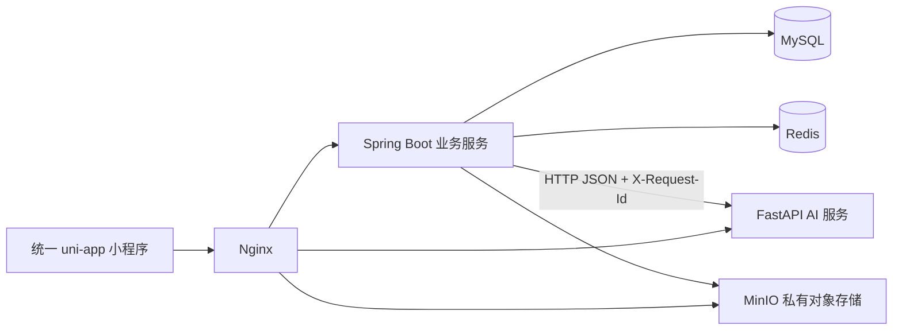

# 总体架构

RayK A1 采用“统一小程序 + Java 模块化单体 + Python AI 服务”的结构。一期不引入 Spring Cloud，也不建设独立 PC 管理后台。

```mermaid
flowchart LR
  MP[统一 uni-app 小程序] --> NG[Nginx]
  NG --> JAVA[Spring Boot 业务服务]
  NG --> AI[FastAPI AI 服务]
  NG --> MINIO[MinIO 私有对象存储]
  JAVA --> MYSQL[(MySQL)]
  JAVA --> REDIS[(Redis)]
  JAVA --> MINIO
  JAVA -->|HTTP JSON + X-Request-Id| AI
```

Python 不访问 Java 数据库；AI 结果先进入待审核状态，医生通过后才能发布给客户。

